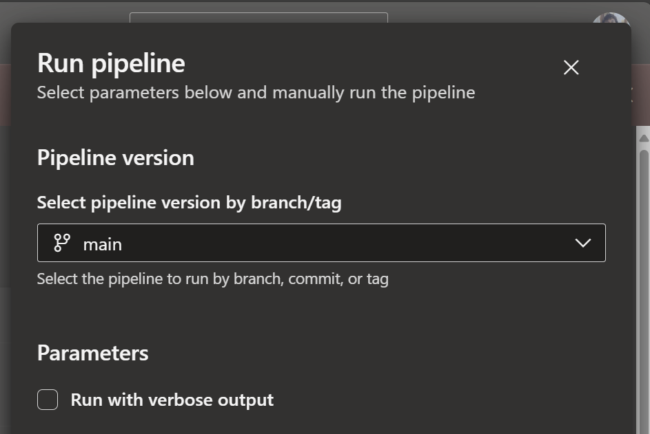

# Pipelines

Pipelines define complete automation workflows consisting of jobs that run nodes. See the [IntoPipeline trait documentation](https://openvmm.dev/rustdoc/linux/flowey_core/pipeline/trait.IntoPipeline.html) for detailed examples.

## Pipeline Jobs

[`PipelineJob`](https://openvmm.dev/rustdoc/linux/flowey_core/pipeline/struct.PipelineJob.html) instances are configured using a builder pattern:

```rust,ignore
let job = pipeline
    .new_job(platform, arch, "my-job")
    .with_timeout_in_minutes(60)
    .with_condition(some_param)
    .ado_set_pool("my-pool")
    .gh_set_pool(GhRunner::UbuntuLatest)
    .dep_on(|ctx| {
        // Define what nodes this job depends on
        some_node::Request { /* ... */ }
    })
    .finish();
```

### Pipeline Parameters

Parameters allow runtime configuration of pipelines. In Azure DevOps, parameters appear as editable fields in the Run pipeline UI (name, description, default).



```rust,ignore
// Define a boolean parameter
let verbose = pipeline.new_parameter_bool(
    "verbose",
    "Run with verbose output",
    ParameterKind::Stable,
    Some(false) // default value
);

// Use the parameter in a job
let job = pipeline.new_job(...)
    .dep_on(|ctx| {
        let verbose = ctx.use_parameter(verbose);
        // verbose is now a ReadVar<bool>
    })
    .finish();
```

#### Stable vs Unstable Parameters

Every parameter in flowey must be declared as either **Stable** or **Unstable** using [`ParameterKind`](https://openvmm.dev/rustdoc/linux/flowey_core/pipeline/enum.ParameterKind.html). This classification determines the parameter's visibility and API stability:

**Stable Parameters ([`ParameterKind::Stable`](https://openvmm.dev/rustdoc/linux/flowey_core/pipeline/enum.ParameterKind.html#variant.Stable))**

Stable parameters represent a **public, stable API** for the pipeline:

- **External Visibility**: The parameter name is exposed as-is in the generated CI YAML, making it callable by external pipelines and users.
- **API Contract**: Once a parameter is marked stable, its name and behavior should be maintained for backward compatibility. Removing or renaming a stable parameter is a breaking change.
- **Use Cases**:
  - Parameters that control major pipeline behavior (e.g., `enable_tests`, `build_configuration`)
  - Parameters intended for use by other teams or external automation
  - Parameters documented as part of the pipeline's public interface

**Unstable Parameters ([`ParameterKind::Unstable`](https://openvmm.dev/rustdoc/linux/flowey_core/pipeline/enum.ParameterKind.html#variant.Unstable))**

Unstable parameters are for **internal use** and experimentation:

- **Internal Only**: The parameter name is prefixed with `__unstable_` in the generated YAML (e.g., `__unstable_debug_mode`), signaling that it's not part of the stable API.
- **No Stability Guarantee**: Unstable parameters can be renamed, removed, or have their behavior changed without notice. External consumers should not depend on them.
- **Use Cases**:
  - Experimental features or debugging flags
  - Internal pipeline configuration that may change frequently
  - Parameters for development/testing that shouldn't be used in production

## Cross-Job Conditions

Sometimes a lightweight job needs to compute a value that other jobs use to
decide whether to run.  Flowey provides two complementary tools for this:

### `Pipeline::gh_job_id_of` / `Pipeline::ado_job_id_of`

These methods return the stable CI job identifier for a given
[`PipelineJobHandle`], allowing you to reference the job in condition
expressions without hard-coding an ID:

```rust,ignore
let classify_handle = classify_job.finish();

// GitHub condition that references the classify job's output:
let gh_cond = format!(
    "needs.{}.outputs.my_output != 'true'",
    pipeline.gh_job_id_of(&classify_handle)
);

// ADO condition:
let ado_cond = format!(
    "and(succeeded(), ne(dependencies.{}.outputs['step.my_output'], 'true'))",
    pipeline.ado_job_id_of(&classify_handle)
);
```

For GitHub, `gh_job_id_of` returns the auto-generated `job{N}` ID.  For ADO,
`ado_job_id_of` returns the override set with `ado_override_job_id`, or
`job{N}` otherwise.

### `PipelineJob::gh_set_job_output_from_env_var`

Declares a GitHub Actions job-level output backed by a `$GITHUB_ENV` variable
that a Rust step writes at runtime.  Dependent jobs read it via
`needs.<job>.outputs.<name>`:

```rust,ignore
let classify_job = pipeline
    .new_job(platform, arch, "classify PR changes")
    .gh_set_job_output_from_env_var(
        "is_non_product",             // output name
        check_pr_changes::GH_ENV_IS_NON_PRODUCT, // env var name constant
    )
    .dep_on(|ctx| check_pr_changes::Request {
        done: ctx.new_done_handle(),
    })
    .finish();
```

### `PipelineJob::ado_dangerous_override_if`

Replaces the default `condition:` for an ADO job.  Use this when a job should
only run if a cross-job output variable has a particular value:

```rust,ignore
vmm_tests_job.ado_dangerous_override_if(
    "and(succeeded(), not(canceled()), \
     ne(dependencies.JOB.outputs['STEP.is_non_product'], 'true'))"
)
```

## PR Change Classification (`check_pr_changes`)

`flowey_lib_hvlite::check_pr_changes` is a thin Flowey node that classifies
the PR's changed files and communicates the result to downstream jobs via
backend-native mechanisms — no GitHub API call, no external scripts.

### How it works

| Backend | Classification | Cross-job output |
|---------|---------------|-----------------|
| GitHub  | `git diff origin/$GITHUB_BASE_REF...HEAD` | Written to `$GITHUB_ENV` as `FLOWEY_IS_NON_PRODUCT`; declared as a job output |
| ADO     | `git diff origin/$SYSTEM_PULLREQUEST_TARGETBRANCH...HEAD` | Published as an ADO step output variable named `is_non_product` |
| Local   | Always "product" (conservative) | N/A |

### Non-product buckets

A PR is classified as non-product only when **every** changed file matches at
least one of the following patterns:

| Pattern | Rationale |
|---------|-----------|
| `Guide/**` | Docs tree; validated by the separate docs pipeline |
| `repo_support/**/*.py` | Repo automation scripts; no effect on product behavior |

Any file outside these patterns — or any classification error — conservatively
marks the PR as a product change.

To add a new non-product bucket, update **both** `is_non_product_path` (Rust,
used by the GitHub and local backends) and the equivalent `if` clause in the
ADO bash script inside `check_pr_changes::Node`.

### Pipeline usage

```rust,ignore
// 1. Create the classify job
let classify_job = pipeline
    .new_job(FlowPlatform::Linux(...), FlowArch::X86_64, "classify PR changes")
    .gh_set_pool(gh_hosted_x64_linux())
    .gh_set_job_output_from_env_var("is_non_product", GH_ENV_IS_NON_PRODUCT)
    .dep_on(|ctx| check_pr_changes::Request {
        done: ctx.new_done_handle(),
    })
    .finish();

// 2. Pre-compute condition strings (before mutable borrows from new_job())
let gh_skip_cond = format!(
    "needs.{}.outputs.is_non_product != 'true' && github.event.pull_request.draft == false",
    pipeline.gh_job_id_of(&classify_job)
);
let ado_skip_cond = check_pr_changes::ado_condition(&pipeline.ado_job_id_of(&classify_job));

// 3. Gate expensive jobs on the classification
let vmm_tests = pipeline
    .new_job(...)
    .gh_dangerous_override_if(&gh_skip_cond)
    // or for ADO:
    // .ado_dangerous_override_if(&ado_skip_cond)
    .dep_on(...)
    .finish();

pipeline.non_artifact_dep(&vmm_tests, &classify_job);
```

```admonish note
`gh_dangerous_override_if` / `ado_dangerous_override_if` **replace** the
default job condition entirely.  Always include the full guard (e.g. the
draft-PR check for GitHub, and `succeeded(), not(canceled())` for ADO)
alongside the classification guard.
```
