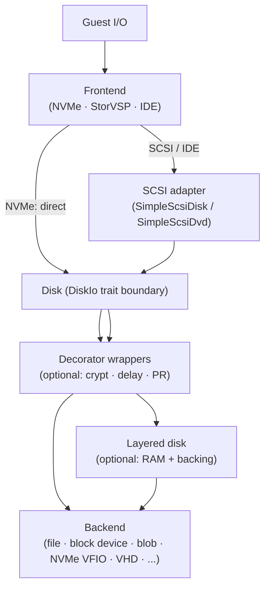

# Storage pipeline

The storage stack is the pipeline that carries a guest I/O request from a guest-visible controller to a backing store and back. It is shared between OpenVMM and OpenHCL. The central abstraction is the `DiskIo` trait — every disk backend implements it — and the `Disk` wrapper, which gives frontends a cheap, cloneable handle to any backend without knowing what is behind it.

```admonish note title="See also"
- [Storage Translation](../openhcl/storage_translation.md) for how OpenHCL maps backing devices onto guest-visible controllers (the *outside* of the shell).
- [Storage Configuration Model](../openhcl/storage_configuration.md) for the VTL2 settings schema (`StorageController`, `Lun`, `PhysicalDevice`).
- Rustdoc for `disk_backend` for the full `DiskIo` trait surface and method contracts.
```

## The pipeline

Every storage I/O in OpenVMM flows through the same layered pipeline:



The key vocabulary:

- **Frontend** — speaks a guest-visible storage protocol and translates requests into `DiskIo` calls.
- **SCSI adapter** — for the SCSI and IDE paths, an intermediate layer (`SimpleScsiDisk` or `SimpleScsiDvd`) that parses SCSI CDB opcodes before calling `DiskIo`.
- **Backend** — a `DiskIo` implementation that reads and writes to a specific backing store.
- **Decorator** — a `DiskIo` implementation that wraps another `Disk` and transforms I/O in transit (encryption, delay, persistent reservations).
- **Layered disk** — a `DiskIo` implementation composed of ordered layers with per-sector presence tracking.

The rest of this page fills in each box.

## Frontends

A frontend is the component that speaks a guest-visible storage protocol and translates requests into `DiskIo` calls. Three frontends exist:

| Frontend | Protocol | Transport | Crate |
|----------|----------|-----------|-------|
| NVMe | NVMe 2.0 | PCI MMIO + MSI-X | `nvme/` |
| StorVSP | SCSI CDB over VMBus | VMBus ring buffers | `storvsp/` |
| IDE | ATA / ATAPI | PCI/ISA I/O ports + DMA | `ide/` |

**NVMe** is the simplest path. The NVMe controller's namespace directly holds a `Disk`. NVM opcodes (READ, WRITE, FLUSH, DSM) map nearly 1:1 to `DiskIo` methods. The FUA bit from the NVMe write command is forwarded directly.

**StorVSP / SCSI** has a two-layer design. StorVSP handles the VMBus transport — negotiation, ring buffer management, sub-channel allocation. It dispatches each SCSI request to an `AsyncScsiDisk` implementation. For hard drives, that implementation is `SimpleScsiDisk`, which parses the SCSI CDB and translates it to `DiskIo` calls. For optical drives, it is `SimpleScsiDvd`.

**IDE** is the legacy path. ATA commands for hard drives call `DiskIo` directly. ATAPI commands for optical drives delegate to `SimpleScsiDvd` through an ATAPI-to-SCSI translation layer — the same DVD implementation that StorVSP uses.

## Backends

A backend is an implementation of `DiskIo` that reads and writes to a specific backing store. Backends are interchangeable — swap one for another without changing the frontend. The frontend holds a `Disk` and doesn't know what is behind it.

The available backends range from simple host files to physical NVMe devices accessed through a user-mode driver. See the [storage backends](../../backends/storage.md) page for the full catalog and platform details.

## Decorators

A decorator is a `DiskIo` implementation that wraps another `Disk` and transforms I/O in transit. Features compose by stacking decorators without modifying backends:

```text
CryptDisk
  └── BlockDeviceDisk
```

Three decorators exist: `CryptDisk` (XTS-AES-256 encryption), `DelayDisk` (injected latency), and `DiskWithReservations` (in-memory persistent reservation emulation). All three forward metadata (sector count, sector size, disk ID, `wait_resize`) to the inner disk unchanged.

See the [storage backends](../../backends/storage.md) page for the decorator catalog.

## The layered disk model

A layered disk is a `DiskIo` implementation composed of multiple layers, ordered from top to bottom. Each layer is a block device with per-sector *presence* tracking. This model powers diff disks, RAM overlays, and caching.

### Reads fall through

When a read arrives, the layered disk checks layers top-to-bottom. The first layer that has the requested sectors provides the data. Sectors not present in any layer are zeroed.

### Writes go to the top

Writes always go to the topmost layer. If that layer is configured with *write-through*, the write also propagates to the next layer.

### Read caching

A layer can be configured to cache read misses: when sectors are fetched from a lower layer, they are written back to the cache layer. This uses a `write_no_overwrite` operation to avoid overwriting sectors that were written between the read and the cache population.

### Layer implementations

Two concrete layers exist today:

- **RamDiskLayer** (`disklayer_ram`) — ephemeral, in-memory. Data is stored in a `BTreeMap` keyed by sector number. Fast, but lost when the VM stops.
- **SqliteDiskLayer** (`disklayer_sqlite`) — persistent, backed by a SQLite database (`.dbhd` file). Designed for dev/test scenarios — no stability guarantees on the on-disk format.

A full `Disk` can appear at the bottom of the stack as a fully-present layer (`DiskAsLayer`). This is the typical case: a RAM or sqlite layer on top of a file or block device.

### Worked example: `memdiff:file:disk.vhdx`

```text
Layer 0: RamDiskLayer (empty, writable)
Layer 1: DiskAsLayer wrapping FileDisk (fully present, read-only from
         the layered disk's perspective)
```

- Guest write → sector goes to the RAM layer.
- Guest read → check RAM; if the sector is present, return it. If absent, fall through to the file.
- Sectors absent from both layers → zero-filled.

Changes are ephemeral — they live in the RAM layer and are lost when the VM stops.

## How configuration becomes a concrete stack

The resource resolver connects configuration (CLI flags, VTL2 settings) to concrete backends. A resource *handle* describes what backend to use; a *resolver* creates it.

The storage resolver chain is recursive. An NVMe controller resolves each namespace's disk, which may be a layered disk, which resolves each layer in parallel, which may itself be a disk that needs resolving.

**Example:** `--disk memdiff:file:path/to/disk.vhdx`

1. CLI parses this into a `LayeredDiskHandle` with two layers:
   - Layer 0: `RamDiskLayerHandle { len: None }` (RAM diff, inherits size from backing disk)
   - Layer 1: `DiskLayerHandle(FileDiskHandle(...))` (the file)
2. The layered disk resolver resolves both layers in parallel.
3. The RAM layer attaches on top of the file layer, inheriting its sector size and capacity.
4. The resulting `LayeredDisk` is wrapped in a `Disk` and handed to the NVMe namespace or SCSI controller.

## Backend catalog

| Backend | Crate | Wraps | Platform | Note |
|---------|-------|-------|----------|------|
| FileDisk | `disk_file` | Host file | Cross-platform | Simplest backend |
| Vhd1Disk | `disk_vhd1` | VHD1 fixed file | Cross-platform | Parses VHD footer |
| VhdmpDisk | `disk_vhdmp` | Windows vhdmp driver | Windows | Dynamic/differencing VHD/VHDX |
| BlobDisk | `disk_blob` | HTTP / Azure Blob | Cross-platform | Read-only, HTTP range requests |
| BlockDeviceDisk | `disk_blockdevice` | Linux block device | Linux | io_uring, resize via uevent, PR passthrough |
| NvmeDisk | `disk_nvme` | Physical NVMe (VFIO) | Linux/Windows | User-mode NVMe driver, resize via AEN |
| StripedDisk | `disk_striped` | Multiple Disks | Cross-platform | Data striping |

Per-backend implementation details (io_uring usage, VHD format internals, etc.) are in rustdoc on each backend crate.

## Online disk resize

Disk resize is a cross-cutting concern that spans backends and frontends.

### Backend detection

Only two backends detect capacity changes at runtime:

- **BlockDeviceDisk** — listens for Linux uevent notifications on the block device. When the host resizes the device, a uevent fires, the backend re-queries the size via ioctl, and `wait_resize` completes.
- **NvmeDisk** — the user-mode NVMe driver monitors Async Event Notifications (AEN) from the physical controller and rescans namespace capacity.

All other backends default to never signaling (`wait_resize` returns `pending()`). Decorators and layered disks delegate `wait_resize` to the inner backend.

### Frontend notification

Once a backend detects a resize, the frontend notifies the guest:

| Frontend | Mechanism | How it works |
|----------|-----------|-------------|
| NVMe | Async Event Notification | Background task per namespace calls `wait_resize`. On change, completes a queued AER command with a changed-namespace-list log page. Guest re-identifies the namespace. |
| StorVSP / SCSI | UNIT_ATTENTION | On the next SCSI command after a resize, `SimpleScsiDisk` detects the capacity change and returns CHECK_CONDITION with UNIT_ATTENTION / CAPACITY_DATA_CHANGED. Guest retries and re-reads capacity. |
| IDE | Not supported | IDE has no capacity-change notification mechanism. |

```admonish warning
`FileDisk` never signals resize. If you attach a file backend and resize the
file at runtime, nothing will happen — the guest will not be notified. Use
`BlockDeviceDisk` or `NvmeDisk` if you need runtime resize.
```

### OpenHCL vs. standalone

The resize path is the same in both contexts. In OpenHCL, `BlockDeviceDisk` detects the uevent from the host, `wait_resize` completes, and the NVMe or SCSI frontend notifies the VTL0 guest through the standard mechanism. There is no special paravisor-level resize interception.

## Virtual optical / DVD

DVD and CD-ROM drives use a different model from disk devices.

`SimpleScsiDvd` implements `AsyncScsiDisk` and manages media state: a disk can be `Loaded` or `Unloaded`. Optical media always uses a 2048-byte sector size. The implementation handles optical-specific SCSI commands: `GET_EVENT_STATUS_NOTIFICATION`, `GET_CONFIGURATION`, `START_STOP_UNIT` (eject), and media change events.

### Eject

Two eject paths exist:

- **Guest-initiated** (SCSI `START_STOP_UNIT` with the load/eject flag): the DVD handler checks the prevent flag, replaces media with `Unloaded`, and calls `disk.eject()`. Once ejected via SCSI, the media is **permanently removed** for the VM lifetime.
- **Host-initiated** (`change_media` via the resolver's background task): can insert new media or remove existing media dynamically.

### Frontend support

| Frontend | DVD support | How |
|----------|-------------|-----|
| StorVSP / SCSI | Yes | `SimpleScsiDvd` implements `AsyncScsiDisk` directly. |
| IDE | Yes | ATAPI wraps `SimpleScsiDvd` through the ATAPI-to-SCSI layer. |
| NVMe | No | NVMe has no removable media concept. Explicitly rejected. |

### CLI

- `--disk file:my.iso,dvd` → SCSI optical drive.
- `--ide file:my.iso,dvd` → IDE optical drive (ATAPI).

The `dvd` flag implicitly sets `read_only = true`.

## `mem:` and `memdiff:` CLI mapping

Both CLI options map to the layered disk model:

- **`mem:1G`** creates a single-layer `LayeredDisk` with a `RamDiskLayer` sized to 1 GB. No backing disk — the RAM layer is the entire disk.
- **`memdiff:file:disk.vhdx`** creates a two-layer `LayeredDisk`: a `RamDiskLayer` (inheriting size from the backing disk) on top of the file. Writes go to the RAM layer; reads fall through to the file for sectors not yet written.

Both use `RamDiskLayerHandle` under the hood. The difference is `len: Some(size)` for `mem:` (standalone RAM disk with explicit size) vs. `len: None` for `memdiff:` (inherits from backing disk).
