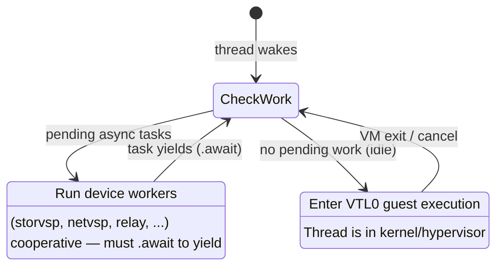

# CPU Scheduling

OpenHCL runs a cooperative async executor on each VP thread. This
page explains how VP threads split time between guest execution and
device work, what happens when things block, and how the
[sidecar kernel](sidecar.md) changes the picture.

For how CPU affinity interacts with storage I/O, see
For how CPU affinity interacts with storage I/O, see the StorVSP
Channels & Subchannels page (under Devices > VMBus > storvsp).

## Thread model

OpenHCL runs one thread per VP in the Underhill threadpool. Each
thread is CPU-affinitized — thread N is pinned to Linux CPU N (which
today equals VP index N).

```text
  VP 0 thread (CPU 0)    VP 1 thread (CPU 1)    VP 2 thread (CPU 2)
  ┌──────────────────┐   ┌──────────────────┐   ┌──────────────────┐
  │ cooperative       │   │ cooperative       │   │ cooperative       │
  │ async executor    │   │ async executor    │   │ async executor    │
  │                   │   │                   │   │                   │
  │ • device workers  │   │ • device workers  │   │ • device workers  │
  │ • VMBus relay     │   │ • VMBus relay     │   │ • VMBus relay     │
  │ • idle: run VTL0  │   │ • idle: run VTL0  │   │ • idle: run VTL0  │
  └──────────────────┘   └──────────────────┘   └──────────────────┘
```

Alongside the VP threads, OpenHCL runs a few additional threads:

- **GET worker** — on a dedicated thread because it issues blocking
  syscalls that would stall the VP executor.
- **Tracing thread** — log collection.
- **CPU-online helper threads** — temporary, used when bringing
  sidecar VPs into Linux.

## Cooperative scheduling

Each VP thread runs an async executor that multiplexes all tasks
targeted at that VP. Tasks yield to each other at `.await` points.
There is **no preemption** — if a task doesn't yield, nothing else on
that thread runs.

### What runs on a VP thread

All tasks with `target_vp = N` and `run_on_target = true` run on
VP N's thread. This includes:

- **StorVSP workers** — one per VMBus channel targeted at this VP.
- **NetVSP workers** — same pattern.
- **VMBus relay tasks** — for relayed host offers.
- **VP dispatch loop** — the idle task that enters VTL0.



## Blocking scenarios

Because the executor is cooperative and single-threaded per VP,
several situations can stall all tasks on a VP.

### VTL0 guest execution

When there are no pending VTL2 tasks, the VP thread enters VTL0 via
an ioctl (`hcl_return_to_lower_vtl`). The thread is in the kernel
until a VM exit returns control to VTL2.

**Mitigation:** OpenHCL registers the io_uring fd with the HCL
kernel module. If async work becomes ready (e.g., a disk I/O
completion arrives via io_uring), the VM run is automatically
cancelled, returning the thread to VTL2 to process the wakeup. This
limits the stall to the time between the completion event and the
next kernel poll — typically very short.

### Kernel syscall blocking

If a device worker issues a blocking syscall (e.g., a disk backend
falls back to synchronous I/O), the thread is in the kernel. No
`.await` yield is possible because the thread itself is blocked.
VTL0 cannot execute either.

**Mitigation:** blocking work is moved to dedicated threads. The GET
worker runs on its own thread specifically because "thread pool
threads will block synchronously waiting on the GET or VMGS."
Device backends that need blocking I/O should use io_uring or
spawn a helper thread.

### Hypervisor intercepts

When VTL2 triggers an operation that requires root partition
handling — for example, an MMIO write that traps to the hypervisor
— the VP can be stopped in the hypervisor while the root processes
the intercept. Both VTL2 and VTL0 are stalled on that VP.

This is not a software-level problem in OpenHCL — it's an artifact
of the hypervisor/root architecture. The VP physically cannot execute
until the root completes the intercept.

### VTL2 blocking VTL0

The reverse of VTL0 blocking: while the VP thread is running VTL2
tasks, VTL0 cannot execute on that VP. A long burst of VTL2 device
work (e.g., processing a large batch of StorVSP completions) delays
guest execution.

## Timeline

A VP thread's execution over time looks like this:

```text
  ──────┬──────────┬───────────┬──────────┬──────────┬─────────
        │ VTL2     │ VTL0      │ VTL2     │ kernel   │ VTL2
        │ tasks    │ guest     │ tasks    │ syscall  │ tasks
        │ run      │ runs      │ run      │ (blocked)│ run
        │          │           │          │          │
        │ storvsp  │ ALL VTL2  │ storvsp  │ ALL VTL2 │ ...
        │ device   │ tasks     │ device   │ tasks    │
        │ workers  │ STALLED   │ workers  │ STALLED  │
  ──────┴──────────┴───────────┴──────────┴──────────┴─────────
```

Each segment is mutually exclusive — only one of VTL2 tasks, VTL0
guest, or kernel work can run at any instant on a given VP thread.

## No work stealing

The Underhill threadpool does **not** implement work stealing.
Targeted tasks always run on their target VP's thread. If VP 2's
thread is blocked in VTL0, a StorVSP worker targeted at VP 2 cannot
be picked up by VP 3's thread.

Untargeted tasks (those without `run_on_target`) run on the thread
that wakes them — which is not the same as stealing. It's
"wake-site placement."

## Sidecar changes

On x64 non-isolated VMs, the [sidecar kernel](sidecar.md) splits VP
execution from device work. Most VPs run in the sidecar — a minimal
kernel that handles VTL0 entry/exit without Linux. Only a few CPUs
(typically one per NUMA node) boot into Linux.

```text
  Boot state (96-VP VM):

  CPU 0:  Linux    ← runs device workers for ALL VPs initially
  CPU 1:  sidecar  ← VTL0 dispatch only (halt → run → intercept)
  ...
  CPU 95: sidecar
```

### VTL0 blocking eliminated

With sidecar, guest VTL0 execution runs on sidecar CPUs while device
workers run on Linux CPUs. These are different threads on different
physical CPUs — they overlap. The "VTL0 blocks device workers"
problem from the cooperative model disappears for sidecar VPs.

```text
  Non-sidecar:                Sidecar:
  ┌────────────────────┐      ┌──────────────────────┐
  │ CPU 3: VTL0 │ VTL2 │      │ CPU 3 (sidecar):     │
  │  CANNOT OVERLAP    │      │  VTL0 runs            │
  └────────────────────┘      └──────────────────────┘
                              ┌──────────────────────┐
                              │ CPU 0 (Linux):        │
                              │  VP 3 device workers  │
                              │  (runs concurrently)  │
                              └──────────────────────┘
```

### Base CPU bottleneck

The tradeoff: all device work for sidecar VPs initially concentrates
on the few Linux CPUs. If the VM has 96 VPs and 1 Linux CPU, that
CPU runs device workers for all 96 VPs — the same cooperative
executor bottleneck, but on fewer CPUs.

### On-demand CPU onlining

When a sidecar VP hits an intercept that requires VTL2 processing
(the first handled VM exit), the sidecar CPU is hot-plugged into
Linux. From that point, the VP's device workers run on its own
thread. This is a **one-way transition** — once a CPU is converted
to Linux, it doesn't go back to sidecar.

```text
  After VP 3 is onlined:

  CPU 0:  Linux    ← workers for VPs 0, 1, 2, 4–95
  CPU 3:  Linux    ← VP 3 workers now run here
  CPU 1:  sidecar
  ...
  CPU 95: sidecar
```

As the workload exercises more VPs, more CPUs come online,
progressively spreading the device work load. The steady state
depends on the I/O pattern — VPs that never trigger VTL2 intercepts
stay in sidecar indefinitely.

## OpenVMM comparison

In standalone OpenVMM (without OpenHCL), the executor model is
simpler:

| Aspect | OpenHCL | OpenVMM |
|--------|---------|---------|
| Thread model | One affinitized thread per VP | Thread pool, one dedicated thread per targeted device worker |
| `target_vp` | Strong — CPU affinity enforced | Weak — dedicated thread, no CPU pinning |
| `run_on_target` | Enforced | Creates a dedicated thread, but no physical affinity |
| `retarget_vp` | Changes target CPU for future work | No-op in thread backend |
| VTL0 blocking | Yes — same thread runs guest | N/A — VP threads are separate from device threads |
| Work stealing | No | No |

The key difference: in OpenVMM, device workers and VP execution run
on separate threads, so there is no VTL0 blocking problem. The
tradeoff is weaker CPU locality — device work doesn't necessarily
run near the VP that initiated it.

## Impact on device design

When writing VMBus device backends, keep these rules in mind:

1. **Never block synchronously** in a device worker on a VP thread.
   Use async I/O (io_uring) or spawn a helper thread for blocking
   work.

2. **Yield frequently.** Long-running synchronous computation in a
   `.poll()` implementation blocks all other tasks on that VP. Break
   work into smaller chunks with `.await` yield points.

3. **Subchannel count ≠ parallelism guarantee.** Even with many
   subchannels, VP stalls (VTL0 residence, kernel blocks) limit how
   much work each channel can actually process.

4. **Sidecar VPs run remotely first.** If a device worker is targeted
   at a sidecar VP, it initially runs on the base CPU, not the target
   CPU. The `is_target_vp_ready()` and `wait_target_vp_ready()` APIs
   on `VmTaskDriver` can be used to detect this.
