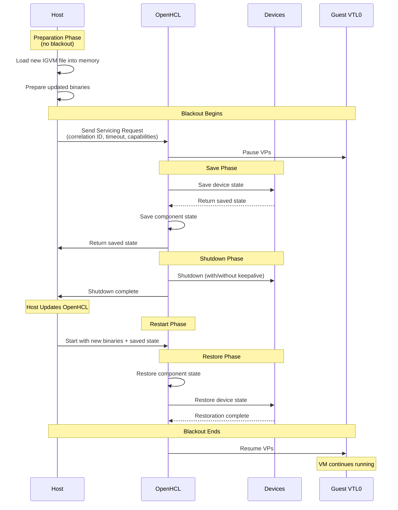

# OpenHCL Servicing

## Overview

OpenHCL servicing (also known as VTL2 servicing) is a mechanism that allows the host to update or service the OpenHCL paravisor while minimizing downtime and maintaining device state. During a servicing operation, OpenHCL can save its state, shut down, be updated by the host, and then restore its previous state when restarted.

This capability is particularly important in production environments where maintaining continuous VM operation during paravisor updates is critical.

A key performance metric for servicing is the **Guest VTL0 VP Blackout** period - the time during which VTL0 guest virtual processors are unable to run. The save and restore operations happen during this blackout period, while other preparation steps (like loading the new IGVM file) can occur before the blackout begins.

## Servicing Lifecycle

The following diagram illustrates the servicing operation flow:

A servicing operation follows these steps:

### 1. Servicing Request

The host initiates a servicing operation by sending a request to OpenHCL with:
- **Correlation ID**: For tracing and diagnostics
- **Timeout Hint**: Deadline for completing the save operation
- **Capabilities Flags**: Indicates what the host supports (e.g., NVMe keepalive support is communicated through these flags)

### 2. State Saving

OpenHCL pauses VM execution and saves state from multiple components. See the [Save State guide](../../dev_guide/contrib/save-state.md) for details on the save/restore implementation.

Saved state includes (examples):
- **State Units**: VMBus relay, device workers, chipset devices, firmware state
- **Servicing Init State**: Firmware type, VM stop time, emuplat state, VMGS state, correlation ID
- **Device-Specific State**: NVMe state (when keepalive enabled), DMA manager state, VMBus client state, MANA state

Note: I/O operations in flight are saved at a specific point in the save process. While some I/O may complete after being saved, these operations will be re-issued upon restore to ensure consistency.

### 3. Component Shutdown

After state is saved, components are shut down based on the keepalive configuration:

**Without Keepalive:**
- Devices are cleanly shut down
- Device handles are closed
- DMA allocations are released
- VFIO device handles are dropped (causing device reset via FLR)

**With Keepalive (NVMe):**
- NVMe devices remain connected (CC.EN=1)
- VFIO device handles are kept open (preventing Function Level Reset)
- DMA buffers in the private pool are preserved
- Device maintains its operational state

### 4. Host Servicing

The host can prepare for servicing while OpenHCL is still running by loading the new IGVM file into memory and preparing updated binaries. Once OpenHCL is stopped, the host applies the updates.

During the blackout period:
- VM guest state in VTL0 is preserved by the host
- OpenHCL binaries and kernel can be updated
- The new IGVM file is applied

### 5. OpenHCL Restart

The host restarts OpenHCL with the new version and provides the saved state as input.

### 6. State Restoration

OpenHCL restores components in dependency order. The DMA Manager is restored first to provide memory pools for other components, followed by device-specific managers and state units. For complete details on the restoration process and ordering, see the implementation in `underhill_core`.

## NVMe Keepalive

NVMe keepalive is a key feature that allows NVMe devices to remain operational during servicing:

### Requirements

NVMe keepalive requires:

1. **Private Pool Availability**: The DMA manager must have private pool ranges configured
2. **Host Support**: The host must support keepalive operations
3. **Configuration**: `OPENHCL_NVME_KEEP_ALIVE` environment variable must be set appropriately

When all requirements are met, NVMe devices use the private pool for DMA allocations that persist across servicing.

### How It Works

When keepalive is enabled:

1. **Persistent DMA Allocations**: NVMe driver uses the private pool for all DMA buffers (when keepalive is enabled; otherwise uses ephemeral allocations)
2. **State Preservation**: 
   - NVMe driver saves queue states, registers, and namespace information
   - DMA manager saves private pool allocation metadata
   - VFIO keeps device handles open
3. **Device Stays Connected**: The NVMe controller remains enabled (CC.EN=1)
4. **Restoration**:
   - Private pool allocations are restored
   - VFIO device is reconnected with persistent DMA clients
   - NVMe driver restores queue state and resumes I/O operations

### Benefits

- **Minimal Downtime**: No device reset or reinitialization required
- **No I/O Interruption**: Pending I/O operations can complete
- **Faster Recovery**: Device is immediately operational after restore
- **Data Integrity**: No loss of in-flight operations

### Without Keepalive

When keepalive is not enabled or not available:

1. NVMe devices are cleanly shut down
2. VFIO device handles are closed (triggering FLR - Function Level Reset)
3. All device state is lost
4. On restore, devices must be fully reinitialized
5. Guest OS must handle device reappearance and potential I/O errors

## Compatibility and Versioning

### Saved State Format

The servicing state uses Protocol Buffers for serialization. For details on save state implementation, compatibility requirements, and best practices, see the [Save State guide](../../dev_guide/contrib/save-state.md).

## Configuration

Servicing behavior is controlled by several environment variables and configuration parameters.

### NVMe Keepalive Configuration

The `OPENHCL_NVME_KEEP_ALIVE` environment variable controls NVMe keepalive behavior:

- `host,privatepool`: Enable keepalive when both host support and private pool are available
- `nohost,privatepool`: Private pool available but host keepalive disabled
- `nohost,noprivatepool`: Keepalive fully disabled

The boot shim (see `openhcl_boot`) infers the configuration based on the detected environment unless explicitly overridden.

### DMA Pool Configuration

The `OPENHCL_IGVM_VTL2_GPA_POOL_CONFIG` parameter controls the VTL2 GPA pool configuration used for the private pool:

- `debug`: Use debug version of lookup table or device tree
- `off`: Disable the VTL2 GPA pool
- `<num_pages>`: Explicitly specify pool size in pages

The boot shim determines pool sizes using heuristics defined in `openhcl_boot` based on the system configuration, unless explicitly overridden.

### Test Scenarios

For testing servicing behavior:
- `SERVICING_SAVE_STUCK`: Causes save operation to wait indefinitely
- `SERVICING_SAVE_FAIL`: Forces save operation to fail
- `SERVICING_RESTORE_STUCK`: Causes restore to wait indefinitely

These help test timeout handling and failure recovery.

## Error Handling

Servicing operations include comprehensive error handling:

### Save Failures
- Component failures during save are logged with detailed error information
- Critical state that cannot be saved may prevent servicing from proceeding
- Timeouts are enforced based on the host-provided deadline

### Restore Failures
- Critical component failures prevent VM startup with detailed error messages
- The correlation ID helps trace issues across the servicing operation

### Timeout Handling
- The host provides a deadline for the save operation
- OpenHCL attempts to complete save before the deadline
- If the deadline is exceeded, the host may force termination

## Implementation Details

### Memory Management

During servicing:
- Private pool pages remain allocated and mapped across the servicing operation
- Shared pool is repopulated on restore
- VTL permissions are preserved and reapplied
- Physical memory addresses may change but are remapped transparently

## See Also

- [Save State Guide](../../dev_guide/contrib/save-state.md) - Implementation details for save/restore
- [NVMe Storage Backend](../../backends/storage/nvme.md) - How NVMe devices participate in servicing
- [DMA Manager](../../openhcl/dma_manager.md) - Memory pool management for persistent allocations
- [OpenHCL Boot Process](./openhcl_boot.md) - Initial startup and initialization
