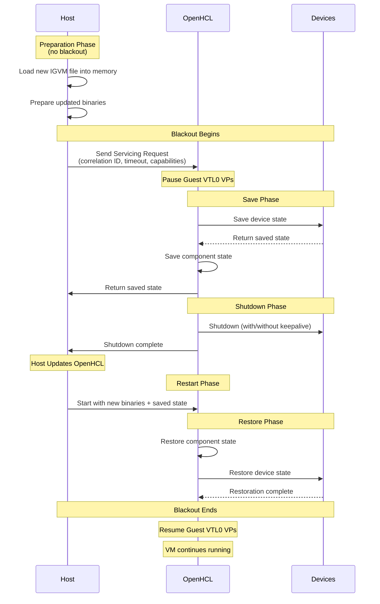

# OpenHCL Servicing

## Overview

OpenHCL servicing (also known as VTL2 servicing) is a mechanism that allows the host to update or service the OpenHCL paravisor while minimizing downtime and maintaining device state. During a servicing operation, OpenHCL can save its state, shut down, be updated by the host, and then restore its previous state when restarted.

This capability is particularly important in production environments where maintaining continuous VM operation during paravisor updates is critical.

A key performance metric for servicing is the **Guest VTL0 VP Blackout** period - the time during which VTL0 guest virtual processors are unable to run. The save and restore operations happen during this blackout period, while other preparation steps (like loading the new IGVM file) can occur before the blackout begins.

## Servicing Lifecycle

The following diagram illustrates the servicing operation flow:



A servicing operation follows these steps:

### 1. Servicing Request

The host initiates a servicing operation by sending a request to OpenHCL with:
- **Correlation ID**: For tracing and diagnostics
- **Timeout Hint**: Deadline for completing the save operation
- **Capabilities Flags**: Indicates what the host supports (e.g., NVMe keepalive support is communicated through these flags)

### 2. State Saving

OpenHCL pauses VM execution and saves state from multiple components. See the [Save State guide](../../dev_guide/contrib/save-state.md) for details on the save/restore implementation.

Saved state includes (examples):
- **State Units**: VMBus relay, device workers, chipset devices, firmware state
- **Servicing Init State**: Firmware type, VM stop time, emuplat state, VMGS state, correlation ID
- **Device-Specific State**: NVMe state (when keepalive enabled), DMA manager state, VMBus client state, MANA state

Note: I/O operations in flight are saved at a specific point in the save process. While some I/O may complete after being saved, these operations will be re-issued upon restore to ensure consistency.

### 3. Component Shutdown

After state is saved, components are shut down based on the keepalive configuration:

**Without Keepalive:**
- Devices are cleanly shut down
- Device handles are closed
- DMA allocations are released
- VFIO device handles are dropped (causing device reset via FLR)

**With Keepalive (NVMe):**
- NVMe devices remain connected (CC.EN=1)
- VFIO device handles are kept open (preventing Function Level Reset)
- DMA buffers in the private pool are preserved
- Device maintains its operational state

### 4. Host Servicing

The host can prepare for servicing while OpenHCL is still running by loading the new IGVM file into memory and preparing updated binaries. Once OpenHCL is stopped, the host applies the updates.

During the blackout period:
- VM guest state in VTL0 is preserved by the host
- OpenHCL binaries and kernel can be updated
- The new IGVM file is applied

### 5. OpenHCL Restart

The host restarts OpenHCL with a new boot flow (see [OpenHCL Boot Process](./openhcl_boot.md)) using the new version and provides the saved state as input.

### 6. State Restoration

OpenHCL restores components in dependency order. The DMA Manager is restored first to provide memory pools for other components, followed by device-specific managers and state units. For complete details on the restoration process and ordering, see the implementation in `underhill_core`.

For details on NVMe keepalive behavior during servicing, see [NVMe Storage Backend](../../backends/storage/nvme.md).

## Compatibility and Versioning

### Saved State Format

The servicing state uses Protocol Buffers for serialization. For details on save state implementation, compatibility requirements, and best practices, see the [Save State guide](../../dev_guide/contrib/save-state.md).

## Configuration

Servicing behavior is controlled by several environment variables and configuration parameters. These parameters are set by the boot shim and passed to the kernel, init, and OpenHCL processes.

### NVMe Keepalive Configuration

The `OPENHCL_NVME_KEEP_ALIVE` environment variable controls NVMe keepalive behavior. For details on the values and their meanings, see the underhill_core options module.

The boot shim (see `openhcl_boot`) infers the configuration based on the detected environment unless explicitly overridden.

### DMA Pool Configuration

The `OPENHCL_IGVM_VTL2_GPA_POOL_CONFIG` parameter controls the VTL2 GPA pool configuration used for the private pool. For details on the parameter values and behavior, see the openhcl_boot cmdline module.

The boot shim determines pool sizes using heuristics defined in `openhcl_boot` based on the system configuration, unless explicitly overridden.

### Test Scenarios

For testing servicing behavior, the `OPENHCL_TEST_CONFIG` environment variable can be set to simulate specific conditions:

- `SERVICING_SAVE_STUCK`: Causes save operation to wait indefinitely
- `SERVICING_SAVE_FAIL`: Forces save operation to fail
- `SERVICING_RESTORE_STUCK`: Causes restore to wait indefinitely

These test scenarios help validate timeout handling and failure recovery. 

```admonish note
These command-line parameters must be sent to the paravisor. The parameters are set by the boot shim and passed via the kernel command line to the init and OpenHCL processes.
```

## Error Handling

Servicing operations include comprehensive error handling:

### Save Failures
- Component failures during save are logged with detailed error information
- Critical state that cannot be saved may prevent servicing from proceeding
- The host provides a deadline for the save operation, but the timeout is not enforced within VTL2

### Restore Failures
- Critical component failures prevent VM startup with detailed error messages
- The correlation ID helps trace issues across the servicing operation

### Timeout Handling
- The host specifies a timeout deadline when initiating the servicing request
- OpenHCL attempts to complete the save operation before the deadline
- If the deadline is exceeded, the host may force termination (timeout enforcement occurs at the host level, not within VTL2)

## Implementation Details

### Memory Management

During servicing:
- Private pool pages remain allocated and mapped across the servicing operation
- Shared pool is recreated on demand during the new boot flow. Since a new kernel boots, locked memory allocations are reconstructed as needed from the normal VTL2 RAM pool.
- VTL permissions are preserved and reapplied during restoration

## See Also

- [Save State Guide](../../dev_guide/contrib/save-state.md) - Implementation details for save/restore
- [NVMe Storage Backend](../../backends/storage/nvme.md) - How NVMe devices participate in servicing
- [DMA Manager](../../openhcl/dma_manager.md) - Memory pool management for persistent allocations
- [OpenHCL Boot Process](./openhcl_boot.md) - Initial startup and initialization
