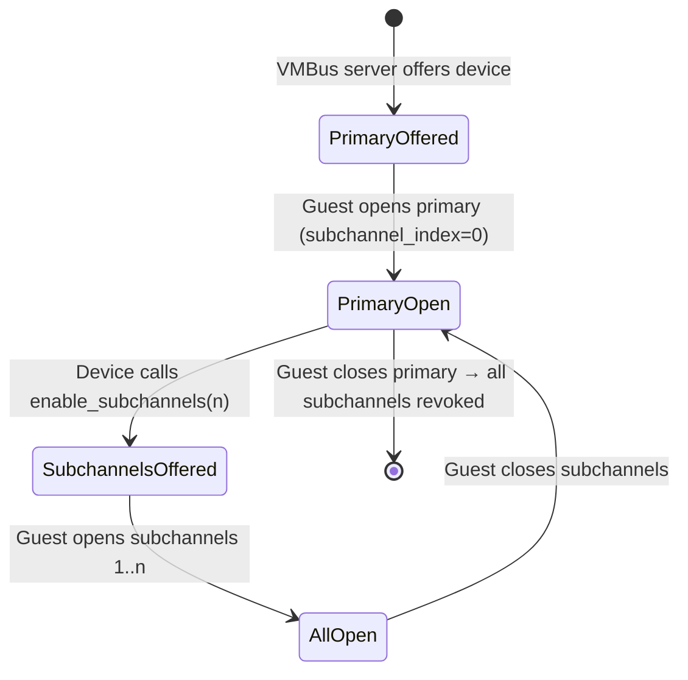

# VMBus Channels

VMBus is the synthetic bus that connects guest drivers to host-side
device backends. Every VMBus device communicates through one or more
**channels** — bidirectional ring-buffer pairs backed by guest memory.

## What is a channel?

A VMBus channel is:

- A **ring buffer pair** — one incoming (guest → host), one outgoing
  (host → guest) — backed by a single guest-allocated GPADL
  (Guest Physical Address Descriptor List).
- An **interrupt/event signal** for each direction.
- A **target VP** — the virtual processor whose thread handles host-side
  processing and receives completion interrupts.

Each channel is identified by a unique `channel_id` assigned by the
VMBus server at offer time. The channel's lifecycle is: **offered →
opened → active → closed**.

```text
  ┌──────────────────────────────────────────────────┐
  │  VMBus Channel                                   │
  │                                                  │
  │  ┌───────────────────┐  ┌───────────────────┐   │
  │  │  Incoming Ring     │  │  Outgoing Ring    │   │
  │  │  (guest → host)   │  │  (host → guest)   │   │
  │  └─────────┬─────────┘  └─────────┬─────────┘   │
  │            │                      │              │
  │  ┌─────────┴──────────────────────┴─────────┐   │
  │  │  GPADL-backed memory (guest-allocated)    │   │
  │  └──────────────────────────────────────────┘   │
  │                                                  │
  │  Signal: guest → host    Signal: host → guest    │
  │  Target VP: set at open time                     │
  └──────────────────────────────────────────────────┘
```

## Subchannels

A **subchannel** is a full additional VMBus channel offer for the same
device instance. It is not a side-queue or a sub-object of the primary
channel — it has its own ring buffer GPADL, its own open/close
lifecycle, its own channel ID, and its own target VP.

The identity of a channel within a device is the tuple
`(interface_id, instance_id, subchannel_index)`:

| Field | Meaning |
|-------|---------|
| `interface_id` | Device type GUID (e.g., SCSI controller) |
| `instance_id` | Specific device instance |
| `subchannel_index` | `0` for the primary channel, `1..n` for subchannels |

### Primary and subchannel relationship

- The **primary channel** (`subchannel_index == 0`) is always offered
  first and handles protocol negotiation.
- **Subchannels** are offered only after the primary is open, when the
  device explicitly enables them.
- A subchannel **cannot exist without its primary channel**. If the
  primary channel closes, all subchannels are automatically revoked
  and closed.



### Why subchannels exist

Subchannels enable **I/O parallelism with CPU locality**. Each channel
has its own ring buffer and target VP, so:

- Multiple VPs can issue I/O concurrently without contending on a
  single ring buffer.
- Each channel's host-side worker runs on the target VP's thread,
  keeping cache lines warm and avoiding cross-VP interrupts.

Without subchannels, all I/O for a device funnels through one ring
and one worker — a bottleneck on multi-VP VMs.

## Target VP

When a guest opens a channel, it specifies a `target_vp` in the open
request. This tells the host which VP should:

- Handle interrupts for new data in the ring.
- Run the device worker that processes requests.

The guest can change the target VP at runtime via `ModifyChannel`.
This is used when VPs come online/offline (e.g., CPU hot-remove) and
the guest needs to rebalance channel assignments.

### VP index, CPU number, and APIC ID

The `target_vp` value is a **VP index** — the hypervisor-level
identifier assigned to each virtual processor, starting at 0. Three
identifiers are often confused:

| Identifier | What it is | Numbering |
|-----------|-----------|-----------|
| **VP index** | Hypervisor-assigned processor number | 0, 1, 2, ... contiguous |
| **Linux CPU number** | The kernel's `cpu` in OpenHCL | Currently equals VP index (see below) |
| **APIC ID** (x86) | Hardware interrupt target | May differ — depends on topology |
| **MPIDR** (aarch64) | ARM processor affinity register | Not the VP index — topology-dependent |

From the **VTL0 guest's** perspective, the guest kernel has its own
CPU numbering (which may or may not match the VP index), and the
guest's `storvsc` driver uses the VMBus `target_vp` field to tell
the host which VP should handle interrupts. The guest driver
typically maps its local CPU number to a VP index when opening
channels.

```text
  VTL0 guest sees:          Host / VTL2 sees:
  ┌──────────────┐          ┌──────────────┐
  │ CPU 0 ───────┼────────► │ VP index 0   │
  │ CPU 1 ───────┼────────► │ VP index 1   │
  │ CPU 2 ───────┼────────► │ VP index 2   │
  │   ...        │          │   ...        │
  └──────────────┘          └──────────────┘
  Guest CPU N maps to       VP index N = Linux
  VP index N (typical)      CPU N (OpenHCL today)
```

In OpenHCL today, the VP index is used directly as the Linux CPU
number (`let cpu = vp.vp_index().index()`). This is a simplifying
assumption, not an architectural guarantee — there are comments in the
code noting that CPU index could in theory differ from VP index. It
works because OpenHCL's boot shim validates that device-tree CPU
ordering matches VP index ordering (panics if not), and controls the
CPU online sequence to maintain the mapping.

The APIC ID is a separate concept. On x86, the APIC ID may not
match the VP index, especially with complex topologies (multiple
sockets, SMT). The hypervisor provides a
`GetVpIndexFromApicId` hypercall for translation. On aarch64, the
device tree `reg` property for each CPU is the MPIDR, which is also
not the VP index.

For VMBus `target_vp`, always use the **VP index**, not the APIC ID
or Linux CPU number. The VMBus server and the OpenHCL threadpool
both consume VP indices directly.

```admonish note
In OpenHCL, `target_vp` maps to a specific CPU-affinitized thread in
the OpenHCL threadpool. In OpenVMM, it maps to a dedicated worker
thread (without physical CPU affinity). See the
[CPU Scheduling](../openhcl/cpu_scheduling.md) page for the full
executor model and its impact on device workers.
```

## Ring buffer model

Each ring is a fixed-size circular buffer. The size is determined at
channel open time and cannot change while the channel is open. Key
properties:

- **No overflow** — if the ring is full, the sender must wait. There
  is no backpressure signal beyond "the ring is full."
- **Batched reads** — the host reads packets in batches via
  `poll_read_batch()` (interrupt-driven) or `try_read_batch()`
  (poll mode, no interrupt).
- **Paired** — rings always come in pairs (incoming + outgoing). A
  channel without both rings is not usable.

For the ring buffer implementation, see the
[`vmbus_ring` rustdoc](https://openvmm.dev/rustdoc/linux/vmbus_ring/index.html).

## Key types

| Type | Crate | Role |
|------|-------|------|
| `OfferKey` | `vmbus_channel` | Channel identity tuple |
| `OfferParams` | `vmbus_channel` | Full offer metadata |
| `OpenData` | `vmbus_channel` | Guest-provided open parameters (target VP, ring GPADL) |
| `ChannelControl` | `vmbus_channel` | Device-side handle to enable subchannels |
| `VmbusDevice` | `vmbus_channel` | Trait for VMBus device implementations |
| `RawAsyncChannel` | `vmbus_channel` | Async wrapper around a ring buffer pair |
| `IncomingRing` / `OutgoingRing` | `vmbus_ring` | Low-level ring buffer types |
| `Queue` | `vmbus_async` | High-level async packet read/write over a channel |
