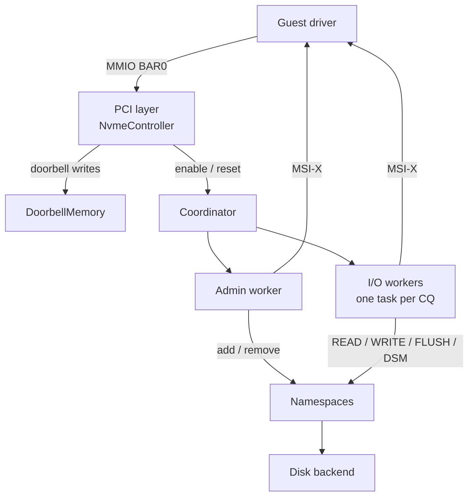

# NVMe emulator

OpenVMM emulates an NVMe controller as a PCI Express device, targeting the
[NVMe Base 2.0](https://nvmexpress.org/specifications/) specification with the
NVM command set. The controller reports vendor ID `0x1414` (Microsoft) and a
version register of `0x00020000` (NVMe 2.0).

This page describes the production emulator
([`nvme`](https://openvmm.dev/rustdoc/linux/nvme/index.html)), which can serve
real IO workloads. Pragmatically it is used today mostly for OpenVMM test
scenarios and for presenting disks to OpenHCL.

```admonish note
A separate fault-injection emulator
([`nvme_test`](https://openvmm.dev/rustdoc/linux/nvme_test/index.html)) is used
to test OpenHCL — it lets test authors inject faults and inspect the state of
the NVMe devices the guest sees. It is a distinct implementation and may
diverge from the production emulator described here.
```

For how NVMe fits into the broader storage pipeline — how namespaces map to
[`DiskIo`](https://openvmm.dev/rustdoc/linux/disk_backend/trait.DiskIo.html)
backends, online disk resize via AEN, and the layered disk model — see the
[storage pipeline](../../architecture/devices/storage.md) page.

## Architecture

The emulator is split into a synchronous PCI/MMIO front end and a set of
asynchronous worker tasks that process queued commands.



### PCI layer

[`NvmeController`](https://openvmm.dev/rustdoc/linux/nvme/struct.NvmeController.html)
owns the PCI configuration space, a 64 KB MMIO region at BAR0, and the MSI-X
table at BAR4. It handles register reads and writes synchronously on the
intercepting thread:

- **Controller registers** (BAR0 offset `< 0x1000`) — `CAP`, `VS`, `CC`,
  `CSTS`, `AQA`, `ASQ`, `ACQ`, and the interrupt mask registers. Writing the
  `CC.EN` bit drives the enable/reset handshake through the coordinator.
- **Doorbells** (BAR0 offset `>= 0x1000`) — submission and completion queue
  tail/head doorbells, spaced by the controller's doorbell stride. Writes are
  forwarded to `DoorbellMemory` (see the [Doorbells](./doorbells.md) page).

### Coordinator

The coordinator sequences controller-wide state transitions — enabling the
controller, resetting it, and hot add/remove of namespaces — so that the admin
and I/O workers never observe the controller in a half-configured state. It
holds the admin worker and dispatches namespace changes to the running I/O
workers.

### Queues, transfers, and completions

Submission and completion queues live in guest memory. To issue a command, the
guest writes a 64-byte entry to a submission queue and rings its tail doorbell;
the owning worker wakes (see the [Doorbells](./doorbells.md) page) and fetches
the command. A command's data buffers are described by **PRP** (Physical Region
Page) entries, which the
[`prp`](https://openvmm.dev/rustdoc/linux/nvme/index.html) module resolves
(including PRP lists, for larger transfers) into a `PagedRange` over guest
memory that the namespace hands to the disk backend. The maximum data transfer
size (`MDTS`) is 256 KB.

When a command completes, the worker writes a 16-byte completion entry to the
associated completion queue and toggles the entry's phase bit so the guest can
detect it by polling, then raises the queue's **MSI-X** interrupt. The guest
acknowledges processed completions by advancing the completion queue's head
doorbell.

### Admin worker

The admin worker processes commands from the Admin Submission Queue — queue
creation and deletion, Identify, Get / Set Features, Get Log Page, and
Asynchronous Event Requests — with the
[`nvme` rustdoc](https://openvmm.dev/rustdoc/linux/nvme/index.html) as the
authoritative list. A few behaviors are worth calling out:

- **Identify Controller** reports the controller's identity (see
  [Controller identity](#controller-identity)).
- **Asynchronous Event Requests** are held open by the guest and completed by
  the controller to deliver changed-namespace notifications (see
  [Namespaces and hot plug](#namespaces-and-hot-plug)).
- **Doorbell Buffer Config** enables shadow doorbells when the queue count fits
  in a single page.
- **Abort** always completes successfully reporting that the command could not
  be aborted — a spec-legal response, since the emulator does not track
  in-flight commands for cancellation.

### I/O workers

Each I/O worker task owns exactly **one completion queue** and the multiple
submission queues that target it. Putting one task per completion queue keeps
completion-queue access single-threaded without locks. Most guests use multiple
submission queues against a single completion queue to express IO classes
rather than to scale throughput, so this rarely limits parallelism.

Supported NVM commands map nearly 1:1 onto
[`DiskIo`](https://openvmm.dev/rustdoc/linux/disk_backend/trait.DiskIo.html):

| NVM command | Disk operation |
|-------------|----------------|
| READ | `read_vectored` |
| WRITE | `write_vectored` (FUA bit forwarded) |
| FLUSH | `sync_cache` |
| Dataset Management (Deallocate) | `unmap` (TRIM) |
| Reservation Register / Acquire / Release / Report | persistent reservations |

## Controller identity

Each emulated controller presents itself as a distinct **NVM subsystem**. Two
identity fields are derived from the controller's subsystem ID (a GUID
configured by the host):

- **Subsystem NQN** (`SUBNQN`) — a unique
  `nqn.2014-08.org.nvmexpress:uuid:<subsystem-id>` string.
- **Serial Number** (`SN`) — a unique value derived from the subsystem ID.

```admonish note
Reporting a unique serial number per controller matters because some guests
key off the Serial Number (or the legacy PCI Vendor ID + Serial Number + Model
Number triple from NVMe Figure 139) to decide whether two controllers belong
to the same NVM subsystem. If distinct controllers share a serial number, such
guests may incorrectly treat them as multiple paths to one subsystem. Deriving
the serial number from the same subsystem ID that feeds the `SUBNQN` keeps the
two identity fields consistent by construction.
```

The Model Number is fixed (`MSFT NVMe Accelerator v1.0`) and the IEEE OUI is
Microsoft's. The serial number can be overridden per controller from the CLI
(see [Configuration](#configuration)).

## Namespaces and hot plug

A [namespace](https://openvmm.dev/rustdoc/linux/nvme/index.html) wraps a single
[`Disk`](https://openvmm.dev/rustdoc/linux/disk_backend/struct.Disk.html) and a
namespace ID. Namespaces can be added and removed at runtime through the
controller client. A background task per namespace watches the disk for
capacity changes (`wait_resize`); when the disk resizes, the controller posts a
Changed Namespace List asynchronous event so the guest re-reads the namespace's
size.

Delivery of the changed-namespace AEN is gated on the host having enabled the
Attached Namespace Attribute Notices class via Set Features, as required by the
spec.

## Configuration

From the OpenVMM CLI, create a named NVMe controller with `--nvme-pci` and
attach disks to it with `--disk on=<name>`:

```bash
openvmm \
    --nvme-pci id=nvme0,pcie_port=rp0 \
    --disk file:/path/to/disk.raw,on=nvme0,nsid=1
```

Relevant `--nvme-pci` options:

- `pcie_port=<port>` or `vpci[=<guid>]` — controller transport.
- `subsys=<guid>` — override the subsystem ID (otherwise derived from the
  controller name).
- `sn=<string>` — override the serial number (otherwise derived from the
  subsystem ID); at most 20 ASCII characters.

See the [`--nvme-pci` options](../../openvmm/management/cli.md) in the CLI
reference for the full list.
